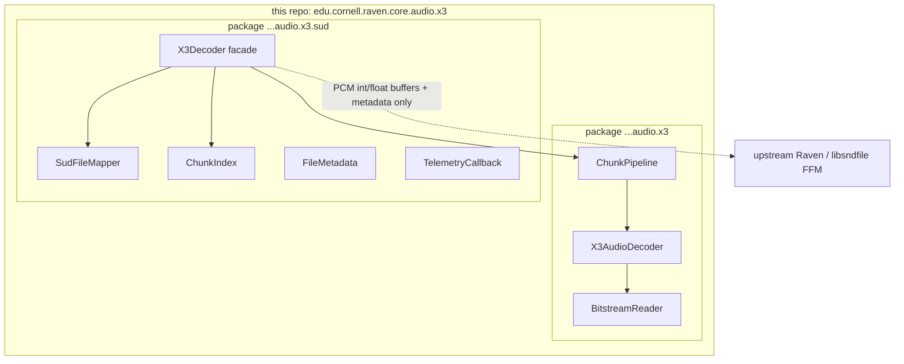

# High-Performance X3 (.SUD) Audio Decoder Development Plan

## 1. Executive Summary

This repository is a **library module** for high-performance **X3 audio decode** and SoundTrap **`.SUD` ingestion**, written in modern **Java (JDK 25+)**.

**In scope here**
* Zero-copy mapping and parsing of Ocean Instruments SoundTrap `.SUD` containers
* In-memory chunk indexing for sequential, bounded, and random-access reads
* JIT-friendly X3 bitstream unpacking into caller-owned interleaved PCM buffers
* Virtual-thread chunk pipeline for parallel decode

**Out of scope here**
* Native `libsndfile` / FLAC / WAV encode and export (owned by **upstream Raven**)
* Any FFM bindings or writer stubs for native audio I/O in this repo

Upstream consumes **PCM sample windows + metadata** this library exposes; it does not live behind an in-repo encoder.

### Key Performance Goals
* **Zero GC Overhead:** Eliminate heap allocation during the core decoding loop.
* **Maximized Parallelism:** Leverage hardware concurrency to out-pace single-threaded file processing.
* **JIT-Driven Acceleration:** Optimize data structures so HotSpot can auto-vectorize heavy mathematical loops.
* **Low Memory Footprint:** Map multi-gigabyte data files virtually without exhausting host RAM.

### Target Read Profiles
* **Sequential Stream:** Read the entire file continuously from start to finish.
* **Bounded Stream:** Read a sequential window of a specific length from a given start point.
* **Random Access (Seeking):** Instantly seek to specific sample indexes or timestamps without generating disk-heavy `.sudx` index files.

### Build tooling
* Gradle 9.3.1 (with wrapper) for build and dependencies.
* Gradle plugins for jlink so custom runtime images can be produced when needed.
* JMH under `src/jmh/java` for decoder microbenchmarks.

### Agent coding rules
Performance and allocation rules for implementers live in **[`AGENTS.md`](AGENTS.md)**. Follow those four hard rules on every decode/parse/math change.

---

## 2. Java package & module layout

| Area | Package | Types (representative) |
| :--- | :--- | :--- |
| Codec / pipeline | `edu.cornell.raven.core.audio.x3` | `BitstreamReader`, `X3AudioDecoder`, `ChunkPipeline` |
| SUD container | `edu.cornell.raven.core.audio.x3.sud` | `SudFileMapper`, `ChunkType`, `ChunkIndex`, `FileMetadata`, `TelemetryCallback`, facade `X3Decoder` |

**JPMS module:** `edu.cornell.raven.core.audio.x3`  
**Exports:** `edu.cornell.raven.core.audio.x3`, `edu.cornell.raven.core.audio.x3.sud`

Dependency direction is one-way: **`.sud` → core `x3`**. Codec types must not depend on container types so upstream can use pure decode APIs without implying SUD-only use.

```text
edu.cornell.raven.core.audio.x3          (codec + pipeline)
edu.cornell.raven.core.audio.x3.sud      (container + facade)
```

---

## 3. Technical Stack & JDK 25 Features

| Feature | Architecture Role | Performance Benefit |
| :--- | :--- | :--- |
| **FFM API (`MemorySegment`)** | Maps raw file blocks off-heap using `Arena.ofConfined()`. | **Zero Data Copying**: Eliminates heap allocation for large buffer structures. |
| **Virtual Threads (Loom)** | Schedules chunk decompression concurrently via `StructuredTaskScope`. | Maximize multi-core execution with low thread scheduling overhead. |
| **JIT Auto-Vectorization** | Structuring loops cleanly to trigger native SIMD compilation (AVX2/Neon). | Cross-platform mathematical parallelization without unstable experimental APIs. |

---

## 4. Data Layout & Chunk Strategy

A `.SUD` file is a sequential container of framed binary chunks. The decoder must parse individual block headers to route data blocks properly:

```text
+------------------------------------------------------------+
|                       FILE HEADER                          |
|  - System Calibration, Sample Rate, Bit Depth, Channels    |
+------------------------------------------------------------+
|                       DATA CHUNKS                          |
|  +------------------------------------------------------+  |
|  | CHUNK HEADER: Type Flag, Payload Length, Timestamp   |  |
|  +------------------------------------------------------+  |
|  | AUDIO PAYLOAD: X3 Variable-Bit-Length Stream Blocks  |  |
|  +------------------------------------------------------+  |
|  | METADATA PAYLOAD: Device Sensor Logs / Raw XML Config|  |
|  +------------------------------------------------------+  |
+------------------------------------------------------------+
```

### Routing Rules
* **Acoustic Audio Chunks:** Decode the bitstream to retrieve raw PCM values.
* **Non-Acoustic Chunks:** Route sensor data (temperature, pressure, voltage) directly to a user-provided telemetry callback.
* **Metadata Chunks:** Parse raw XML records directly into text strings for file headers.

---

## 5. Phase-by-Phase Implementation Blueprint

### Phase 1: Zero-Copy File Mapping & Metadata Ingestion
* **Objective:** Parse file syntax without copying data buffers onto the JVM heap.
* **Package:** `...audio.x3.sud` (`SudFileMapper`, `FileMetadata`).
* **Implementation:**
  * Open the `.SUD` file using standard channel APIs and map it into an off-heap `MemorySegment`.
  * Define structured `VarHandle` layouts to fetch global file configurations (sample rate, channel counts).
  * Extract device tracking tags and the initial configuration block.

### Phase 2: In-Memory Index Table Generator (Fast Seeking)
* **Objective:** Allow rapid random access without building `.sudx` sidecar files on disk.
* **Package:** `...audio.x3.sud` (`ChunkIndex`, `ChunkType`).
* **Implementation:**
  * Build a single-pass, ultra-fast initialization path that skips across chunk payloads using chunk size headers.
  * Cache layout data in a flattened primitive array: `long[] indexTable`.
  * For every audio chunk, index exactly 4 elements: `[Sample_Offset, File_Byte_Offset, Chunk_Length, Frame_Timestamp]`.
  * **Seeking Mechanism:** Binary search on the `indexTable` to find target sample offsets instantly.

### Phase 3: JIT-Friendly Audio & Bitstream Unpacking
* **Objective:** Structure predictive coding loops to guarantee HotSpot auto-vectorization across dual primitive types.
* **Package:** `...audio.x3` (`BitstreamReader`, `X3AudioDecoder`).
* **Implementation:**
  * Track variable-bit streaming pointers inside primitive `int` registers using bitwise operators (`<<`, `>>`, `&`).
  * **Flatten all multi-channel audio tracks** into a single pre-allocated, flat 1D array (`int[]` or `short[]`) to maximize hardware cache locality.
  * **Expose Dual Exporters:**
    1. Integer export path that fills a caller-owned interleaved 1D buffer (for upstream native write or further processing).
    2. Floating-point export path via a zero-allocation streaming loop into a caller-owned `float[]`, normalizing 16-bit integers to `[-1.0f, 1.0f]` by multiplying by `(1.0f / 32768.0f)`.
  * Keep the normalization loop free of branching, object allocations, or sub-method wrappers so the JIT can map it to SIMD lanes.

### Phase 4: Threaded Parallel Processing Chunk Pipeline
* **Objective:** Scale decoder processing throughput linearly across available CPU threads.
* **Package:** `...audio.x3` (`ChunkPipeline`); facade orchestration in `...audio.x3.sud` (`X3Decoder`).
* **Implementation:**
  * Divide the master file-mapped `MemorySegment` into isolated block slices based on the index table.
  * Distribute **stateless** audio decoding chunks across virtual worker threads using `StructuredTaskScope`.
  * Limit active virtual threads using a carrier-thread throttle to avoid over-saturating underlying native processing blocks.

### Phase 5: Upstream integration design (not implemented in this repo)

* **Objective:** Define the **consumer contract** so upstream Raven can stream decoded PCM into `libsndfile` (or any other encoder) without this library owning native I/O.
* **This library guarantees:**
  * Zero-copy (or zero-copy where possible) map of `.SUD` input
  * Index-backed seek for sequential / bounded / random read profiles
  * Export of interleaved PCM into **caller-owned** buffers: `short[]` / `int[]` and/or `float[]` in `[-1, 1]`, optionally views as off-heap `MemorySegment`
  * `FileMetadata` (sample rate, channels, bit depth, device tags) available alongside decoded windows
* **Upstream owns:**
  * `libsndfile` FFM downcalls, FLAC/WAV (and other) format selection
  * Lifecycle of native handles, arenas used for encode-side native memory
  * Pipelining encode of window *N* while this library decodes window *N+1* (if desired)
* **Suggested handoff shape (conceptual only — no SPI types in this repo):**
  * Interleaved frames in a caller-owned `short[]`/`float[]` or `MemorySegment`
  * Frame count, channel count, sample rate from `FileMetadata` / decode return values
  * Upstream calls e.g. `sf_writef_int` / `sf_writef_float` with those addresses

Do **not** add `LibsndfileWriter` or equivalent types under `src/` in this repository.

---

## 6. Coding agent guardrails (summary)

Full text and non-negotiables: **[`AGENTS.md`](AGENTS.md)**.

1. **No heap allocation** in decode / parse / math hot loops.
2. **1D flattened PCM only** (no `short[][]` / `int[][]`).
3. **Stateless chunk work** suitable for virtual threads (no heavy locks on the hot path).
4. **Pure countable loops** for HotSpot auto-vectorization.

---

## 7. Architecture (repo boundary)


